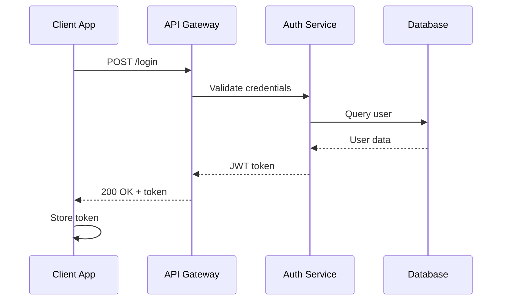
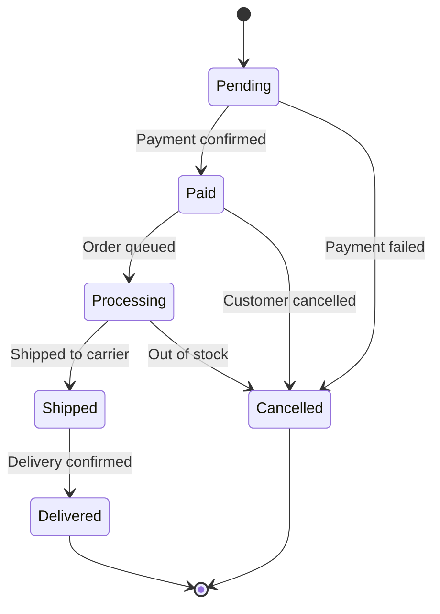
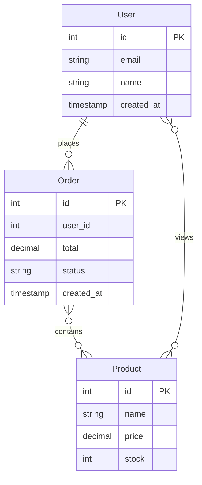
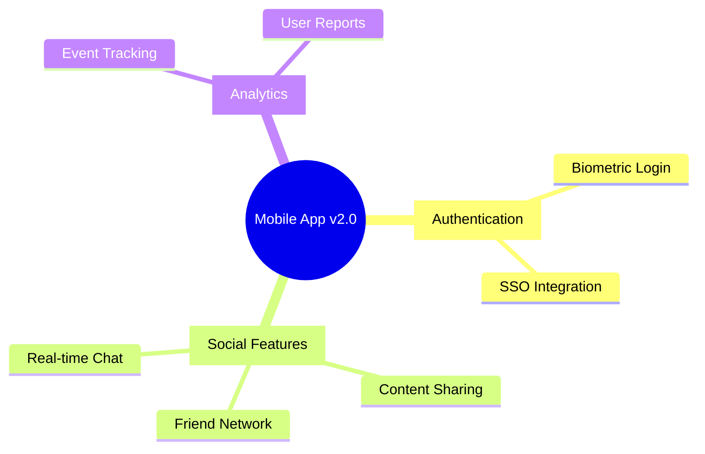

# Map - Visual Thinking and Diagram Creation

## What It Does

Map enables visual thinking by creating and manipulating diagrams, flowcharts, concept maps, and other visual representations. By externalizing structure visually, you discover relationships and generate insights that text alone can't reveal.

**Key Value**: Think in pictures, not just words. Map helps you see patterns, relationships, and gaps that are invisible in linear text.

## When to Use This Tool

- **System design** - Visualize architecture and data flows
- **Process mapping** - Document workflows and procedures
- **Concept exploration** - Map relationships between ideas
- **State machines** - Model system states and transitions
- **Decision trees** - Visualize choice paths
- **Problem decomposition** - Break complex problems into visual structure

## How It Works

Map provides operations to build and transform visual representations:

```
Create → Add Elements → Connect → Transform → Observe Insights
```

### Operations

| Operation | Purpose |
|-----------|---------|
| `create` | Start a new diagram |
| `update` | Modify existing elements |
| `delete` | Remove elements |
| `transform` | Apply visual changes (rotate, move, resize, recolor, regroup) |
| `observe` | Record observations and insights from the visual |

### Diagram Types

Map supports 11 diagram types, each optimized for different visualization needs. All diagrams output as **Mermaid syntax** for easy rendering.

| Type | Best For | When to Use |
|------|----------|-------------|
| `flowchart` | Processes, algorithms, decision paths | When mapping step-by-step procedures or control flow |
| `stateDiagram` | System states and transitions | When modeling simple state machines or workflows |
| `conceptMap` | Relationships between ideas | When exploring connections between concepts or components |
| `treeDiagram` | Hierarchies and decomposition | When showing parent-child relationships or organizational structure |
| `graph` | Networks and connections | When visualizing general networks or interconnected systems |
| `sequenceDiagram` | **Component interactions** | When showing message exchanges between actors/systems over time (API calls, protocol flows) |
| `stateMachine` | **System behavior** | When modeling complex state transitions with start/end states (order lifecycle, authentication flow) |
| `erDiagram` | **Data models** | When designing database schemas with entities, attributes, and relationships |
| `mindMap` | **Brainstorming and ideation** | When organizing ideas hierarchically around a central concept (feature planning, problem decomposition) |
| `contextDiagram` | **System context (C4 model)** | When showing high-level system boundaries with external actors and systems |
| `custom` | Anything else | When none of the specialized types fit your needs |

### Element Types

| Type | What It Represents |
|------|-------------------|
| `node` | A thing (concept, state, step) |
| `edge` | A relationship/connection |
| `container` | A grouping of elements |
| `annotation` | Notes or labels |

## Interactive Examples

### Scenario 1: Creating an Authentication Flowchart

**Context**: Mapping the user authentication flow to identify security checkpoints.

**Input**:
```json
{
  "operation": "create",
  "diagramId": "user-auth-flow",
  "diagramType": "flowchart",
  "iteration": 1,
  "nextOperationNeeded": true,
  "elements": [
    {"id": "start", "type": "node", "label": "User Visits Login Page", "properties": {"shape": "oval", "color": "green"}},
    {"id": "input", "type": "node", "label": "Enter Credentials", "properties": {"shape": "rectangle"}},
    {"id": "validate", "type": "node", "label": "Validate Credentials", "properties": {"shape": "diamond"}},
    {"id": "success", "type": "node", "label": "Redirect to Dashboard", "properties": {"shape": "rectangle", "color": "green"}},
    {"id": "failure", "type": "node", "label": "Show Error Message", "properties": {"shape": "rectangle", "color": "red"}},
    {"id": "edge1", "type": "edge", "source": "start", "target": "input", "properties": {}},
    {"id": "edge2", "type": "edge", "source": "input", "target": "validate", "properties": {}},
    {"id": "edge3", "type": "edge", "source": "validate", "target": "success", "label": "Valid", "properties": {}},
    {"id": "edge4", "type": "edge", "source": "validate", "target": "failure", "label": "Invalid", "properties": {}}
  ],
  "observation": "Mapping the authentication flow to identify security checkpoints"
}
```

**Output**:
```json
{
  "operation": "create",
  "diagramId": "user-auth-flow",
  "diagramType": "flowchart",
  "iteration": 1,
  "nextOperationNeeded": true,
  "elementCount": 9,
  "status": "success"
}
```

**What This Means**: A flowchart with 9 elements (5 nodes, 4 edges) has been created. The visual structure immediately shows:
- Linear flow from login to validation
- Decision point at validation (diamond shape)
- Two clear paths: success (green) and failure (red)

---

### Scenario 2: Creating a System Architecture Concept Map

**Context**: Visualizing microservices architecture to identify dependencies.

**Input**:
```json
{
  "operation": "create",
  "diagramId": "system-architecture",
  "diagramType": "conceptMap",
  "iteration": 1,
  "nextOperationNeeded": true,
  "elements": [
    {"id": "api", "type": "node", "label": "API Gateway", "properties": {"layer": "edge"}},
    {"id": "auth", "type": "node", "label": "Auth Service", "properties": {"layer": "services"}},
    {"id": "users", "type": "node", "label": "User Service", "properties": {"layer": "services"}},
    {"id": "db", "type": "node", "label": "PostgreSQL", "properties": {"layer": "data"}},
    {"id": "cache", "type": "node", "label": "Redis Cache", "properties": {"layer": "data"}},
    {"id": "e1", "type": "edge", "source": "api", "target": "auth", "label": "validates", "properties": {}},
    {"id": "e2", "type": "edge", "source": "api", "target": "users", "label": "routes to", "properties": {}},
    {"id": "e3", "type": "edge", "source": "users", "target": "db", "label": "persists", "properties": {}},
    {"id": "e4", "type": "edge", "source": "users", "target": "cache", "label": "caches", "properties": {}}
  ],
  "insight": "Visualizing the data flow reveals the cache as a potential single point of failure"
}
```

**Output**:
```json
{
  "operation": "create",
  "diagramId": "system-architecture",
  "diagramType": "conceptMap",
  "iteration": 1,
  "nextOperationNeeded": true,
  "elementCount": 9,
  "status": "success"
}
```

**What This Means**: The concept map shows:
- **Layers**: Edge (API), Services (Auth, Users), Data (DB, Cache)
- **Dependencies**: API → Auth and Users; Users → DB and Cache
- **Insight discovered**: Cache is a SPOF - this might not be obvious from code alone

---

### Scenario 3: Transforming and Observing

**Context**: Reorganizing the diagram to highlight a different perspective.

**Input**:
```json
{
  "operation": "transform",
  "diagramId": "system-architecture",
  "diagramType": "conceptMap",
  "iteration": 2,
  "nextOperationNeeded": false,
  "transformationType": "regroup",
  "elements": [
    {"id": "critical-path", "type": "container", "label": "Critical Path", "contains": ["api", "auth", "users", "db"], "properties": {"highlight": true}},
    {"id": "cache-optional", "type": "container", "label": "Optional/Degradable", "contains": ["cache"], "properties": {"highlight": false}}
  ],
  "observation": "Regrouping by criticality shows which services must be highly available",
  "insight": "The cache should be optional - system must function (slower) without it",
  "hypothesis": "Adding cache fallback logic will improve system resilience"
}
```

**What This Means**: By regrouping elements into containers ("Critical Path" vs "Optional/Degradable"), a new insight emerges: if the cache is truly optional, there should be fallback logic. This architectural insight came from visual reorganization.

---

### Scenario 4: API Authentication Flow (Sequence Diagram)

**Context**: Documenting how components interact during user authentication to identify potential bottlenecks and security checkpoints.

**Input**:
```json
{
  "operation": "create",
  "diagramId": "api-auth-flow",
  "diagramType": "sequenceDiagram",
  "iteration": 1,
  "nextOperationNeeded": false,
  "elements": [
    {"id": "client", "type": "node", "label": "Client App", "properties": {}},
    {"id": "api", "type": "node", "label": "API Gateway", "properties": {}},
    {"id": "auth", "type": "node", "label": "Auth Service", "properties": {}},
    {"id": "db", "type": "node", "label": "Database", "properties": {}},
    {"id": "msg-1", "type": "edge", "source": "client", "target": "api", "label": "POST /login", "properties": {"arrowType": "->>"}},
    {"id": "msg-2", "type": "edge", "source": "api", "target": "auth", "label": "Validate credentials", "properties": {"arrowType": "->>"}},
    {"id": "msg-3", "type": "edge", "source": "auth", "target": "db", "label": "Query user", "properties": {"arrowType": "->>"}},
    {"id": "msg-4", "type": "edge", "source": "db", "target": "auth", "label": "User data", "properties": {"arrowType": "-->>"}},
    {"id": "msg-5", "type": "edge", "source": "auth", "target": "api", "label": "JWT token", "properties": {"arrowType": "-->>"}},
    {"id": "msg-6", "type": "edge", "source": "api", "target": "client", "label": "200 OK + token", "properties": {"arrowType": "-->>"}},
    {"id": "msg-7", "type": "edge", "source": "client", "target": "client", "label": "Store token", "properties": {"arrowType": "->>"}}
  ],
  "observation": "The authentication flow involves 4 components with 3 network hops before responding to the client"
}
```

**Output**:
```json
{
  "operation": "create",
  "diagramId": "api-auth-flow",
  "diagramType": "sequenceDiagram",
  "iteration": 1,
  "nextOperationNeeded": false,
  "elementCount": 11,
  "status": "success",
  "mermaidOutput": "sequenceDiagram\n    participant client as Client App\n    participant api as API Gateway\n    participant auth as Auth Service\n    participant db as Database\n    client->>api: POST /login\n    api->>auth: Validate credentials\n    auth->>db: Query user\n    db-->>auth: User data\n    auth-->>api: JWT token\n    api-->>client: 200 OK + token\n    client->>client: Store token"
}
```

**Mermaid Diagram**:


**What This Means**:
- **Participants**: Nodes become participants in the sequence (Client App, API Gateway, Auth Service, Database)
- **Message Flow**: Edges represent messages exchanged over time, top to bottom
- **Arrow Types**:
  - `->>` for synchronous requests (solid arrow)
  - `-->>` for asynchronous responses (dashed arrow)
- **Insight**: The visual reveals 3 network hops (Client → API → Auth → DB) before the user gets a response, which could impact latency
- **Self-messages**: The "Store token" message shows client-to-client interaction

---

### Scenario 5: Order Lifecycle (State Machine)

**Context**: Modeling the complete order lifecycle from creation to completion, including all possible states and transitions to understand the business process.

**Input**:
```json
{
  "operation": "create",
  "diagramId": "order-lifecycle",
  "diagramType": "stateMachine",
  "iteration": 1,
  "nextOperationNeeded": false,
  "elements": [
    {"id": "pending", "type": "node", "label": "Pending", "properties": {"isStart": true}},
    {"id": "paid", "type": "node", "label": "Paid", "properties": {}},
    {"id": "processing", "type": "node", "label": "Processing", "properties": {}},
    {"id": "shipped", "type": "node", "label": "Shipped", "properties": {}},
    {"id": "delivered", "type": "node", "label": "Delivered", "properties": {"isEnd": true}},
    {"id": "cancelled", "type": "node", "label": "Cancelled", "properties": {"isEnd": true}},
    {"id": "t1", "type": "edge", "source": "pending", "target": "paid", "label": "Payment confirmed", "properties": {}},
    {"id": "t2", "type": "edge", "source": "paid", "target": "processing", "label": "Order queued", "properties": {}},
    {"id": "t3", "type": "edge", "source": "processing", "target": "shipped", "label": "Shipped to carrier", "properties": {}},
    {"id": "t4", "type": "edge", "source": "shipped", "target": "delivered", "label": "Delivery confirmed", "properties": {}},
    {"id": "t5", "type": "edge", "source": "pending", "target": "cancelled", "label": "Payment failed", "properties": {}},
    {"id": "t6", "type": "edge", "source": "paid", "target": "cancelled", "label": "Customer cancelled", "properties": {}},
    {"id": "t7", "type": "edge", "source": "processing", "target": "cancelled", "label": "Out of stock", "properties": {}}
  ],
  "observation": "The order can be cancelled from multiple states (Pending, Paid, Processing) but not after shipping"
}
```

**Output**:
```json
{
  "operation": "create",
  "diagramId": "order-lifecycle",
  "diagramType": "stateMachine",
  "iteration": 1,
  "nextOperationNeeded": false,
  "elementCount": 13,
  "status": "success",
  "mermaidOutput": "stateDiagram-v2\n    [*] --> Pending\n    Pending --> Paid: Payment confirmed\n    Paid --> Processing: Order queued\n    Processing --> Shipped: Shipped to carrier\n    Shipped --> Delivered: Delivery confirmed\n    Pending --> Cancelled: Payment failed\n    Paid --> Cancelled: Customer cancelled\n    Processing --> Cancelled: Out of stock\n    Delivered --> [*]\n    Cancelled --> [*]"
}
```

**Mermaid Diagram**:


**What This Means**:
- **Start State**: `[*] --> Pending` shows that all orders begin in the Pending state
- **End States**: Both `Delivered` and `Cancelled` lead to `[*]`, representing terminal states
- **Happy Path**: Pending → Paid → Processing → Shipped → Delivered
- **Cancellation Windows**:
  - From Pending (payment failed)
  - From Paid (customer cancellation)
  - From Processing (inventory issues)
- **Critical Insight**: Once an order reaches "Shipped" state, it cannot be cancelled - this is a business rule that's immediately visible in the state diagram
- **Transition Labels**: Each edge label describes the event or condition that triggers the state change
- **Business Logic**: The visual reveals that there's no path from Shipped back to any previous state, indicating a one-way progression after dispatch

---

### Scenario 6: E-Commerce Database Schema (Entity-Relationship Diagram)

**Context**: Designing a database schema for an e-commerce platform to understand entity relationships, attribute requirements, and cardinality constraints.

**Input**:
```json
{
  "operation": "create",
  "diagramId": "ecommerce-schema",
  "diagramType": "erDiagram",
  "iteration": 1,
  "nextOperationNeeded": false,
  "elements": [
    {"id": "User", "type": "node", "label": "User", "properties": {
      "attributes": [
        {"name": "id", "type": "int", "key": true},
        {"name": "email", "type": "string"},
        {"name": "name", "type": "string"},
        {"name": "created_at", "type": "timestamp"}
      ]
    }},
    {"id": "Order", "type": "node", "label": "Order", "properties": {
      "attributes": [
        {"name": "id", "type": "int", "key": true},
        {"name": "user_id", "type": "int"},
        {"name": "total", "type": "decimal"},
        {"name": "status", "type": "string"},
        {"name": "created_at", "type": "timestamp"}
      ]
    }},
    {"id": "Product", "type": "node", "label": "Product", "properties": {
      "attributes": [
        {"name": "id", "type": "int", "key": true},
        {"name": "name", "type": "string"},
        {"name": "price", "type": "decimal"},
        {"name": "stock", "type": "int"}
      ]
    }},
    {"id": "rel-1", "type": "edge", "label": "places", "source": "User", "target": "Order", "properties": {"cardinality": "||--o{"}},
    {"id": "rel-2", "type": "edge", "label": "contains", "source": "Order", "target": "Product", "properties": {"cardinality": "}o--o{"}},
    {"id": "rel-3", "type": "edge", "label": "views", "source": "User", "target": "Product", "properties": {"cardinality": "}o--o{"}}
  ],
  "observation": "The schema reveals a classic e-commerce pattern with User-Order-Product entities and both one-to-many and many-to-many relationships"
}
```

**Output**:
```json
{
  "operation": "create",
  "diagramId": "ecommerce-schema",
  "diagramType": "erDiagram",
  "iteration": 1,
  "nextOperationNeeded": false,
  "elementCount": 6,
  "status": "success",
  "mermaidOutput": "erDiagram\n    User {\n        int id PK\n        string email\n        string name\n        timestamp created_at\n    }\n    Order {\n        int id PK\n        int user_id\n        decimal total\n        string status\n        timestamp created_at\n    }\n    Product {\n        int id PK\n        string name\n        decimal price\n        int stock\n    }\n    User ||--o{ Order : places\n    Order }o--o{ Product : contains\n    User }o--o{ Product : views"
}
```

**Mermaid Diagram**:


**What This Means**:
- **Entities as Nodes**: Each entity (User, Order, Product) becomes a table-like block in the diagram
- **Attributes with Types**: The `properties.attributes` array defines columns with data types (int, string, decimal, timestamp)
- **Primary Keys**: Attributes with `"key": true` are marked with `PK` suffix in the diagram
- **Relationship Cardinality**:
  - `||--o{` (one-to-many): User **places** Order - one user can place zero or many orders
  - `}o--o{` (many-to-many): Order **contains** Product - one order can contain many products, one product can be in many orders
  - `}o--o{` (many-to-many): User **views** Product - one user can view many products, one product can be viewed by many users
- **Foreign Keys**: The `user_id` in Order implicitly references User.id, establishing the one-to-many relationship
- **Data Type Insights**:
  - `decimal` for monetary values (price, total) ensures precision
  - `timestamp` for audit trail (created_at) enables temporal queries
  - `int` for stock enables inventory calculations
- **Schema Validation**: The visual reveals potential issues:
  - No OrderItem join table explicitly shown - the many-to-many relationship between Order and Product likely needs an intermediate table with quantity and price_at_purchase
  - No indexes indicated - might want to index foreign keys (user_id) and frequently queried fields (status, email)
- **Business Logic**: The "views" relationship suggests product analytics tracking, separate from purchase behavior

**Design Considerations**:
- To properly implement the Order-Product many-to-many, you'd typically add an `OrderItem` entity with order_id, product_id, quantity, and unit_price
- Consider adding a `payment_method` field to Order for transaction tracking
- The `stock` field in Product suggests inventory management - you might need stock alerts or reserved quantities

---

### Scenario 7: Feature Brainstorming (Mind Map)

**Context**: Planning features for a mobile app v2.0 release using a mind map to organize ideas hierarchically, group related features, and visualize the feature tree from central concept to implementation details.

**Input**:
```json
{
  "operation": "create",
  "diagramId": "feature-brainstorm",
  "diagramType": "mindMap",
  "iteration": 1,
  "nextOperationNeeded": false,
  "elements": [
    {"id": "mobile-app", "type": "node", "label": "Mobile App v2.0", "properties": {"isRoot": true, "shape": "circle"}, "contains": ["auth", "social", "analytics"]},
    {"id": "auth", "type": "node", "label": "Authentication", "properties": {"shape": "square"}, "contains": ["biometric", "sso"]},
    {"id": "biometric", "type": "node", "label": "Biometric Login", "properties": {}},
    {"id": "sso", "type": "node", "label": "SSO Integration", "properties": {}},
    {"id": "social", "type": "node", "label": "Social Features", "properties": {"shape": "square"}, "contains": ["sharing", "friends", "chat"]},
    {"id": "sharing", "type": "node", "label": "Content Sharing", "properties": {}},
    {"id": "friends", "type": "node", "label": "Friend Network", "properties": {}},
    {"id": "chat", "type": "node", "label": "Real-time Chat", "properties": {}},
    {"id": "analytics", "type": "node", "label": "Analytics", "properties": {"shape": "square"}, "contains": ["tracking", "reports"]},
    {"id": "tracking", "type": "node", "label": "Event Tracking", "properties": {}},
    {"id": "reports", "type": "node", "label": "User Reports", "properties": {}}
  ],
  "observation": "The mind map reveals three major feature pillars (Authentication, Social, Analytics) with clear implementation sub-tasks under each category"
}
```

**Output**:
```json
{
  "operation": "create",
  "diagramId": "feature-brainstorm",
  "diagramType": "mindMap",
  "iteration": 1,
  "nextOperationNeeded": false,
  "elementCount": 11,
  "status": "success",
  "mermaidOutput": "mindmap\n  root((Mobile App v2.0))\n    [Authentication]\n      Biometric Login\n      SSO Integration\n    [Social Features]\n      Content Sharing\n      Friend Network\n      Real-time Chat\n    [Analytics]\n      Event Tracking\n      User Reports"
}
```

**Mermaid Diagram**:


**What This Means**:
- **Root Node**: `Mobile App v2.0` is the central concept, marked with `isRoot: true` and rendered as a circle `(( ))` in Mermaid
- **Hierarchical Structure**: The `contains` array defines parent-child relationships without explicit edges
  - Level 1: Three main feature categories (Authentication, Social Features, Analytics)
  - Level 2: Specific implementations under each category
- **Visual Shapes**:
  - Circle `(( ))` for the root - the main product/concept
  - Square `[ ]` for major feature categories - organizational grouping
  - Plain text for leaf nodes - concrete implementation tasks
- **Feature Distribution**:
  - Authentication: 2 sub-features (Biometric, SSO)
  - Social Features: 3 sub-features (Sharing, Friends, Chat)
  - Analytics: 2 sub-features (Tracking, Reports)
- **Critical Insights**:
  - Social features dominate with 3 implementations - likely the differentiator for v2.0
  - Authentication improvements focus on user convenience (biometric) and enterprise adoption (SSO)
  - Analytics is scoped to essential tracking and reporting - not overbuilt
- **Scope Clarity**: The visual immediately shows that v2.0 has 7 concrete implementation tasks across 3 pillars - helps with sprint planning and effort estimation
- **Cross-cutting Concerns**: Notice that "Event Tracking" in Analytics likely needs integration with all other features (auth events, social interactions, etc.)

**Brainstorming Strategy**:
- **Radial Organization**: Ideas branch outward from the center, making it easy to add new categories or expand existing ones
- **Depth vs. Breadth**: The current structure is 2 levels deep - consider if any leaf nodes need further breakdown (e.g., "Biometric Login" might expand to "Face ID", "Fingerprint", "Voice Recognition")
- **Missing Branches**: The mind map might reveal gaps - for example, no "Performance" or "Security" categories despite adding social features that could impact both
- **Prioritization**: Main branches (square nodes) can be color-coded or numbered in future iterations to indicate development priority

**Practical Use Cases**:
- **Product Planning**: Visualize feature scope for stakeholder presentations
- **Sprint Planning**: Each leaf node becomes a potential user story or task
- **Team Alignment**: Shared visual helps cross-functional teams understand the full feature landscape
- **Dependency Discovery**: Realize that SSO Integration might affect both Authentication and Social Features (single sign-on for friend connections)
- **Gap Analysis**: Missing node like "Onboarding" or "Settings" becomes obvious when you see the overall structure

---

## User Experience

Map produces visual structure records:

| Field | What It Tells You |
|-------|-------------------|
| `operation` | What action was performed |
| `diagramId` | Unique identifier for this diagram |
| `diagramType` | What kind of visualization |
| `iteration` | How many modifications |
| `nextOperationNeeded` | Whether to continue building |
| `elementCount` | Number of elements in the diagram |
| `elements` | Nodes, edges, containers, annotations |
| `observation` | What you notice from the visual |
| `insight` | New understanding gained |
| `hypothesis` | Testable idea emerging from the visual |

**Building Flow**:
```
Create → Add nodes/edges → Transform (regroup, recolor) → Observe insights → Iterate
```

## Integration Tips

- **Start simple** - Add elements iteratively rather than all at once
- **Use properties for meaning** - Colors, shapes, and layers encode information
- **Group related elements** - Containers reveal structure
- **Record observations** - The insight field captures what you learn
- **Transform to see differently** - Regrouping reveals hidden patterns
- **Chain with Trace** - Use Trace to reason about what the diagram shows
- **Chain with Hypothesis** - Visual insights become testable hypotheses

## Quick Reference

| Parameter | Type | Required | Description |
|-----------|------|----------|-------------|
| `operation` | enum | Yes | create, update, delete, transform, observe |
| `diagramId` | string | Yes | Unique identifier |
| `diagramType` | enum | Yes | flowchart, stateDiagram, conceptMap, treeDiagram, graph, sequenceDiagram, stateMachine, erDiagram, mindMap, contextDiagram, custom |
| `iteration` | number | Yes | Current iteration count |
| `nextOperationNeeded` | boolean | Yes | Whether to continue |
| `elements` | array | No | Nodes, edges, containers with id, type, label, properties |
| `transformationType` | enum | No | rotate, move, resize, recolor, regroup |
| `observation` | string | No | What you notice |
| `insight` | string | No | New understanding |
| `hypothesis` | string | No | Testable idea |
| `mermaidOutput` | string | No | Generated Mermaid diagram syntax (automatically included) |
